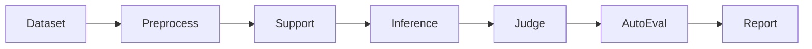

# gage-eval 基准测试指南

本文档提供当前 `gage-eval-main/` 仓库中已有 benchmark 配置的执行命令和说明。

## 通用评估链



## 使用概述

以下命令默认在 `gage-eval-main/` 仓库根目录执行，并通过核心入口 `run.py` 启动。

* **`--config`**: 定义模型、提示词（prompts）和数据集参数的 YAML 配置文件路径。
* **`--output-dir`**: 存储日志和结果的目录。
* **`--run-id`**: 特定评估运行的唯一标识符。

## 支持的后端引擎

该框架支持多种推理后端，以确保在不同环境下的灵活性。目前支持的引擎包括但不限于：

* **vLLM**: 针对本地模型的高吞吐量服务进行了优化。
* **LiteLLM**: 用于调用各种外部 LLM API（OpenAI、Anthropic 等）的统一接口。

要切换后端，请修改特定基准测试 YAML 文件中 `role_adapters` 部分的 `backend_id` 参数：

```yaml
role_adapters:
  - adapter_id: dut_mmlu_pro_vllm_qwen
    role_type: dut_model
    backend_id: "vllm"  # 选项: vllm, litellm 等

```

如果你需要进行完整评估，请调整 `max_samples`/`limit`。

---

## Config

### BizFinBench v2

BizFinBench.v2 是 BizFinBench 的第二个版本。它完全基于来自中国和美国股票市场的真实用户查询构建，弥补了学术评估与实际金融业务之间的鸿沟。

* **真实且实时**：100% 源自真实金融平台的查询，并集成了在线评估能力。
* **专家级难度**：包含 29,578 个问答对，极具挑战性，需要专业的金融推理能力。
* **全面覆盖**：涵盖 4 个核心业务场景、8 个基础任务和 2 个在线任务。

#### 执行命令

```bash
python run.py \
  --config config/custom/biz_fin_bench_v2/bizfinbench_v2.yaml \
  --output-dir ./gage_runs/final_test \
  --run-id bizfinbench_v2

```

### MRCR v2

OpenAI MRCR（多轮指代消解）是一个长文本数据集，用于基准测试 LLM 区分隐藏在上下文中的多个“针”的能力。此评估灵感源自 Gemini 首次提出的 MRCR 评估（[https://arxiv.org/pdf/2409.12640v2](https://arxiv.org/pdf/2409.12640v2)）。OpenAI MRCR 扩展了任务难度，并提供了用于复现结果的开源数据。

#### 执行命令

```bash
python run.py \
  --config config/custom/mrcr/openai_mrcr.yaml \
  --output-dir ./gage_runs/final_test \
  --run-id mrcr

```

#### 详细配置

下表列出了用于自定义模型长文本检索和推理能力评估的关键参数。

| 参数 | 描述 | 支持的值 |
| --- | --- | --- |
| **`needle_type`** | 通过指定隐藏在上下文窗口中的不同信息片段（针）的数量，来定义“大海捞针”测试的复杂度。 | `2needle`, `4needle`, `8needle` |
| **`max_content_window`** | 指定评估期间使用的“干草堆”（输入文本）的最大 token 长度。这定义了被测试模型的上下文容量上限。 | *整数 (例如, 32768, 128000)* |

### Global PIQA

Global PIQA 是一个涵盖 100 多种语言的参与式常识推理基准，由来自全球 65 个国家的 335 名研究人员手工构建。Global PIQA 中的 116 种语言变体覆盖了五大洲、14 个语系和 23 种书写系统。在 Global PIQA 的非平行划分中，超过 50% 的示例涉及当地美食、习俗、传统或其他特定文化元素。

#### 执行命令

```bash
python run.py \
  --config config/custom/global_piqa/global_piqa_chat.yaml \
  --output-dir ./gage_runs/final_test \
  --run-id global_piqa

```

### LiveCodeBench

**LiveCodeBench** 为编程任务上的 LLM 全方位评估提供了一个“实时”更新的框架。通过持续集成来自编程竞赛平台的新问题，它有效地缓解了数据污染问题。

#### 关键评估维度：

* **代码生成（Code Generation）**：根据自然语言需求编写功能性代码。
* **测试输出预测（Test Output Prediction）**：预测特定代码片段和输入的运行结果。
* **代码执行（Code Execution）**：模拟代码的逻辑流以确定其行为。

#### 执行命令

```bash
python run.py \
  --config config/custom/live_code_bench/live_code_bench_test.yaml \
  --output-dir ./gage_runs/final_test \
  --run-id live_code_bench_test

```

#### 详细配置

| 参数 | 描述 | 支持的值 |
| --- | --- | --- |
| **`scenario`** | 定义具体的评估任务。 | `codegeneration`, `codeexecution`, `testoutputprediction` |
| **`release_version`** | 指定数据集版本以跟踪随时间变化的性能。 | `release_v1` 到 `release_v6` |
| **`local_dir`** | 下载的数据集缓存的本地目录路径。 | *本地文件路径* |

### GPQA-Diamond

**GPQA-Diamond** 是一个高难度的多选题问答数据集，其问题由 **生物、物理和化学** 领域的专家编写并进行同行评审。该基准测试专门设计为“谷歌搜索无效（Google-proof）”，旨在测试 LLM 科学推理的上限。

为了说明难度：即使拥有超过 30 分钟的时间和完整的互联网访问权限，回答其专业领域之外问题的专家（例如，物理学家解决化学问题）的准确率也仅为 **34%**。

#### 执行命令

```bash
python run.py \
  --config config/custom/gpqa_diamond/async_chat.yaml \
  --output-dir ./gage_runs/final_test \
  --run-id gpqa_diamond

```

#### 详细配置

| 参数 | 描述 | 支持的值 |
| --- | --- | --- |
| **`gpqa_prompt_type`** | 确定用于评估的提示策略和上下文注入方法。 | `zero_shot`, `chain_of_thought`, `self_consistency`, `5_shot`, `retrieval`, `retrieval_content` |

### MathVista

MathVista 是一个在视觉情境下的综合数学推理基准。它由三个新创建的数据集组成：IQTest、FunctionQA 和 PaperQA，分别针对缺失的视觉领域进行设计，旨在评估对智力测试图形的逻辑推理、对函数图表的代数推理以及对学术论文图表的科学推理。它还整合了文献中的 9 个 MathQA 数据集和 19 个 VQA 数据集，显著丰富了该基准测试中视觉感知和数学推理挑战的多样性和复杂性。MathVista 总共包含从 31 个不同数据集中收集的 6,141 个示例。

#### 执行命令

```bash
python run.py \
  --config config/custom/mathvista/chat.yaml \
  --output-dir ./gage_runs/final_test \
  --run-id mathvista_chat

```

#### 详细配置

| 参数 | 描述 | 支持的值 |
| --- | --- | --- |
| **`use_caption`** | 确定是否向模型提供图像的文本描述。 | `true`, `false` |
| **`use_ocr`** | 启用或禁用包含从图形中提取的光学字符识别（OCR）文本。 | `true`, `false` |
| **`shot_num`** | 提示词上下文中包含的 few-shot 示例数量。 | *整数 (例如, 0, 3, 5)* |
| **`shot_type`** | 定义 few-shot 示例的推理格式。 | `'solution'` (自然语言), `'code'` (Program-of-Thought) |

### Video-MME

Video-MME 是首个面向视频分析的多模态大语言模型（MLLMs）综合评估基准。它旨在全面评估 MLLM 处理视频数据的能力，涵盖广泛的视觉领域、时间跨度和数据模态。Video-MME 包含 **900 个视频**，总时长 **254 小时**，以及 **2,700 对人工标注的问答对**。

**核心特点：**
* **时间维度上的跨度**：涵盖短视频（< 2 分钟）、中视频（4~15 分钟）和长视频（30~60 分钟），时长从 11 秒到 1 小时不等，充分考验模型的时序动态理解能力；
* **视频类型的多样性**：覆盖 6 大主要视觉领域（知识、影视、体育竞技、生活记录、多语言等），并细分为 30 个子领域，确保广泛场景泛化性；
* **数据模态的广度**：除视频帧外，还整合了字幕、音频等多模态输入，全面评估 MLLM 的综合能力；
* **标注质量**：所有数据均为人工全新收集和标注，不来自任何现有视频数据集，保证了多样性和高质量。

#### 执行命令

```bash
python GAGE/run.py \
  --config GAGE/config/custom/video_mme/chat.yaml \
  --output-dir ./gage_runs/final_test \
  --run-id video_mme
```

#### 详细配置

| 参数 | 描述 | 支持的值 |
| --- | --- | --- |
| **`pre_encode_video`** | 是否在发送到后端之前将视频 URL 获取并编码为 base64 data URL。 | `true`, `false` |
| **`include_subtitles`** | 是否在 prompt 中引入字幕文本。 | `true`, `false` |

### AMO-Bench

AMO-Bench（Advanced Mathematical Olympiad Benchmark）是一个高级数学推理基准测试，难度达到或超过奥林匹克竞赛水平，包含 50 道人工精心设计的问题。现有的基准测试广泛利用高中数学竞赛来评估大语言模型（LLM）的数学推理能力。然而，由于性能饱和（例如 AIME24/25），许多现有的数学竞赛在评估顶级 LLM 方面效果越来越差。为解决这一问题，AMO-Bench 通过以下方式引入了更具挑战性的难题：确保所有 50 道问题（1）经过专家交叉验证，达到至少国际数学奥林匹克（IMO）难度标准；（2）完全原创，防止数据记忆导致的性能泄漏。此外，AMO-Bench 中的每道问题只需要最终答案而非证明，从而支持自动且稳健的评估。

实验结果表明，在 AMO-Bench 上评估的 26 个 LLM 中，即使是表现最好的模型准确率也只有 52.4%，大多数 LLM 的得分低于 40%。除了表现不佳之外，进一步分析显示了随着测试时计算增加的有希望的扩展趋势。这些结果突显了当前 LLM 在数学推理方面仍有很大的提升空间。

AMO-Bench 根据 answer_type 使用不同的评估方法：
- **description**：使用 LLM 评判模型进行语义比较
- **number/set**：使用 math_verify 解析器进行数学等价性验证
- **variable**：使用 try_list 和 sympy 求解器进行函数验证

#### 执行命令

```bash
python GAGE/run.py \
  --config GAGE/config/custom/amo-bench/amo.yaml \
  --output-dir ./gage_runs/final_test \
  --run-id amo_bench
```

### HMMT（哈佛-麻省理工数学锦标赛）

该数据集包含 HMMT 2025 年 2 月竞赛的题目，用于 MathArena 排行榜。HMMT 是由哈佛大学和麻省理工学院学生组织的著名数学竞赛，其题目极具挑战性，旨在测试参赛者的高级数学推理和问题解决能力。

#### 执行命令

```bash
python GAGE/run.py \
  --config GAGE/config/custom/hmmt/feb_2025.yaml \
  --output-dir ./gage_runs/final_test \
  --run-id hmmt

```

### BeyondAIME

BeyondAIME 是一个精心设计的测试集，用于评估高级数学推理能力。其创建遵循以下核心原则，以确保评估的公平性和挑战性：

* **高难度**：题目来源于高中和大学数学竞赛，难度级别大于或等于 AIME 第 11-15 题。
* **抗污染**：每道题目都经过人工修改，确保其独特性，不会出现在标准的预训练语料库中，从而真实测试模型的推理能力。
* **专注推理，而非知识**：数据集专门测试推理能力，确保题目不需要超出标准大学水平的数学知识。
* **鲁棒的问题设计**：数据集避免了"伪证明"类题目。对于需要类证明步骤的题目，它们被重新设计，使得猜测答案的难度与正式求解相当。
* **自动化且准确的评估**：每道题目的答案都是正整数，可以实现明确无误且 100% 准确的自动化验证。

#### 执行命令

```bash
python GAGE/run.py \
  --config GAGE/config/custom/beyond_aime/beyond_aime_chat.yaml \
  --output-dir ./gage_runs/final_test \
  --run-id beyond_aime

```
### AIME 2024

该数据集包含 2024 年美国数学邀请赛（AIME）的试题。AIME 是一项著名的数学竞赛，以其极具挑战性的数学问题而闻名。

#### 执行命令

```bash
python run.py \
  --config config/custom/aime24/aime2024_chat.yaml \
  --output-dir ./gage_runs/final_test \
  --run-id aime2024

```

### AIME 2025

2025 年美国数学邀请赛（AIME）。

#### 执行命令

```bash
python run.py \
  --config config/custom/aime25/aime2025_chat.yaml \
  --output-dir ./gage_runs/final_test \
  --run-id aime2025

```

### AIME 2026

2026 年美国数学邀请赛（AIME）。

#### 执行命令

```bash
python GAGE/run.py \
  --config GAGE/config/custom/aime26/aime2026_chat.yaml \
  --output-dir ./gage_runs/final_test \
  --run-id aime2026

```

### GSM8K

GSM8K（Grade School Math 8K）是一个包含 8.5K 道高质量、语言多样化的小学数学应用题数据集。该数据集旨在支持基础数学问题的问答任务，这些问题需要多步推理才能解决。

#### 执行命令

```bash
python GAGE/run.py \
  --config GAGE/config/custom/gsm8k/gsm8k.yaml \
  --output-dir ./gage_runs/final_test \
  --run-id gsm8k

```

### MMLU-Pro

MMLU-Pro 数据集是一个更稳健、更具挑战性的大规模多任务理解数据集，旨在更严格地基准测试大语言模型的能力。该数据集包含跨多个学科的 12,000 个复杂问题。

#### 执行命令

```bash
python run.py \
  --config config/custom/mmlu_pro/mmlu_pro_chat.yaml \
  --output-dir ./gage_runs/final_test \
  --run-id mmlu_pro_chat

```

#### 详细配置

| 参数 | 描述 | 支持的值 |
| --- | --- | --- |
| **`n_few_shot`** | 指定在目标问题之前提供给模型以引导其响应格式和推理的上下文示例数量。 | *整数 (例如, 0, 5)* |

### HLE

Humanity's Last Exam (HLE) 是一个位于人类知识前沿的多模态基准，旨在成为同类中最后一个覆盖广泛学科的闭口学术基准。HLE 包含横跨数学、人文和自然科学等数十个学科的 2,500 个问题。HLE 由全球领域专家开发，由适合自动评分的多选题和简答题组成。

#### 执行命令

```bash
python run.py \
  --config config/custom/hle/hle_chat.yaml \
  --output-dir ./gage_runs/final_test \
  --run-id hle

```

### MATH500

该数据集包含来自 MATH 基准测试的 500 个问题的子集，这些问题是由 OpenAI 在其《Let's Verify Step by Step》论文中创建的。

#### 执行命令

```bash
python run.py \
  --config config/custom/math500/chat.yaml \
  --output-dir ./gage_runs/final_test \
  --run-id math500

```

### MME

MME 是一个针对多模态大语言模型（MLLMs）的综合评估基准。

#### 执行命令

```bash
python run.py \
  --config config/custom/mme/chat.yaml \
  --output-dir ./gage_runs/final_test \
  --run-id mme

```

### MMAU-Pro

MMAU-Pro 是一个综合基准测试，旨在评估多模态模型的**音频智能能力**。

它涵盖语音、环境声音、音乐及其组合，跨越 **49 种不同的感知和推理技能**，例如声学源特征化、声学场景推理、时序和定量推理以及过程推理（[数据集卡片](https://huggingface.co/datasets/gamma-lab-umd/MMAU-Pro)）。

该数据集包含 **5,305 个专家标注的音频-问题-答案三元组**，音频片段采集自多样化的真实场景（包括长音频和多音频情况）。

#### 1. 执行前准备

在运行评估之前，请准备测试集的本地 JSONL 版本和相应的音频文件。

每条 JSONL 记录应遵循与 Hugging Face 数据集相同的字段架构（例如 `id`、`audio_path`、`question`、`answer`、`choices`、`length_type`、`perceptual_skills`、`reasoning_skills`、`category`、`transcription` 等）。

#### 2. 执行命令

使用以下命令启动基准测试流程：

```bash
python run.py \
  --config config/custom/mmau_pro/mmau_pro_audio.yaml \
  --output-dir ./gage_runs_mmau_pro/final_test \
  --run-id mmau_pro
```

#### 3. 详细配置

| 参数 | 描述 | 支持的值 |
| --- | --- | --- |
| **`path`** | 本地 MMAU-Pro JSONL 文件的路径（架构与 `gamma-lab-umd/MMAU-Pro` 对齐）。 | *有效的 JSONL 文件路径* |
| **`audio_path_root`** | 存储引用音频文件（例如 `data/*.wav`）的根目录。 | *有效的目录路径* |
| **`audio_index`** | 当每个样本提供多个音频路径时，要使用的音频片段索引。 | *非负整数（默认 `0`）* |
| **`model_path` / `tokenizer_path`** | vLLM 后端使用的支持音频的模型和分词器的本地路径（例如 Qwen2-Audio 系列）。 | *包含 `config.json` 和分词器文件的模型目录* |

### ARC-AGI-2

ARC-AGI-2 包含 1,000 个公开训练任务和 120 个公开评估任务。

#### 执行命令

```bash
python run.py \
  --config config/custom/arcagi2/arcagi2_vllm_async_chat.yaml \
  --output-dir ./gage_runs/final_test \
  --run-id mme

```

### CharXiv

CharXiv: 绘制多模态 LLM 中真实图表理解的鸿沟。这是一个由人类专家完全策划的、多样化且极具挑战性的图表理解基准。它包含了 2,323 个手动从 arXiv 预印本中搜集的高分辨率图表。每个图表配有 4 个描述性问题（3 个可回答，1 个不可回答）和 1 个推理问题，所有问题都要求提供易于验证的开放词汇简短回答。

#### 执行命令

```bash
python run.py \
  --config config/custom/charxiv/charxiv_vllm_async_chat.yaml \
  --output-dir ./gage_runs_charxiv_reasoning/final_test \
  --run-id charxiv_reasoning

```

### ScreenSpot-Pro

ScreenSpot-Pro 是一个先进的基准测试，专门设计用于评估大型多模态模型在专业、高分辨率环境下的 GUI Grounding（图形用户界面定位）能力。与通用的 UI 基准不同，它侧重于在复杂软件生态系统中进行自主计算机操作所需的精度。

#### 执行命令

```bash
python run.py \
  --config config/custom/screen_spot/screenspot_pro_vllm_async_chat.yaml \
  --output-dir ./gage_runs_screenspot_pro/final_test \
  --run-id screenspot_pro

```

### SimpleQA Verified

来自 Google DeepMind 和 Google Research 的 1,000 个提示词的事实性基准，旨在可靠地评估 LLM 的参数化知识。

#### 执行命令

```bash
python run.py \
  --config config/custom/simpleqa_verified/simpleqa_verified_vllm_async_chat.yaml \
  --output-dir ./gage_simpleqa-verified/simpleqa-verified \
  --run-id simpleqa-verified

```

### **MMSU**

**MMSU** 是一个专门为口语理解与推理设计的综合性 Benchmark。MMSU 包含 **5,000 个精心筛选的“音频-问题-答案”三元组 (triplets)**，涵盖 **47 个不同的任务**。

为了使该基准测试具备坚实的语言学理论基础，我们系统性地融入了广泛的语言学现象，包括：

* **语音与韵律：** Phonetics, Prosody
* **结构：** Syntax, Syntactics
* **语义与副语言学：** Semantics, Paralinguistics

#### Pre-Execution (预执行)

在运行评估之前，请从 Hugging Face 下载数据集：

> **[MMSU Dataset on Hugging Face](https://huggingface.co/datasets/ddwang2000/MMSU)**

#### Execution Command (执行命令)

使用以下命令启动 Benchmark 流程：

```bash
python run.py \
  --config config/custom/mmsu/mmsu_audio.yaml \
  --output-dir ./gage_runs/final_test \
  --run-id mmsu

```

#### Detailed Configuration (详细配置)

| 参数 | 描述 | 支持的取值 |
| --- | --- | --- |
| **`audio_path_root`** | 存储 MMSU 数据的根目录。 | *有效系统路径 (Path)* |

### Inverse IFEval

是一个新颖的基准测试，旨在评估大型语言模型（LLM）遵循反直觉指令的能力，这些指令刻意偏离了传统的训练范式。该数据集挑战模型克服其根深蒂固的训练惯例，忠实地执行与标准认知模式或标注规范相冲突的指令。

#### Execution Command

使用以下命令启动基准测试流程：

```bash
python GAGE/run.py \
  --config GAGE/config/custom/inverse_ifeval/inverse_ifeval_qwen_omni_suite.yaml \
  --output-dir ./gage_runs/final_test \
  --run-id inverse_ifeval
```

### ForecastBench（静态）

ForecastBench 可以走 **GAGE 静态评测闭环**：`forecastbench` loader 按 `id` 连接 `question_set` 与 `resolution_set` JSON，`forecastbench_static` preprocessor 产出标准 `Sample`，`forecastbench_probability` 规则 metric 评分，`forecastbench_probability_summary` 聚合。P0 默认只保留 **已结算的 Polymarket** 行（`source_filter`、`resolved_only`）。数据路径在数据集 `params` 的 `question_set_path` / `resolution_set_path`；`hub: inline` 仅占位，不用于传入核心 JSON 路径。

#### 执行命令（full）

```bash
python run.py \
  --config config/custom/forecastbench/polymarket_static_full.yaml \
  --output-dir ./gage_runs/forecastbench_full \
  --run-id forecastbench_full
```

全量运行时，请通过环境变量 `FORECASTBENCH_QUESTION_SET_PATH`、`FORECASTBENCH_RESOLUTION_SET_PATH` 指向真实 ForecastBench 题目集与结算集；仓库内 `tests/fixtures/forecastbench/` 仅用于单测和快速链路验证。接入说明见 `docs/forecastbench/README.md`。
